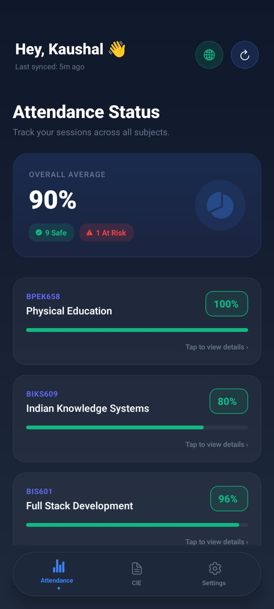
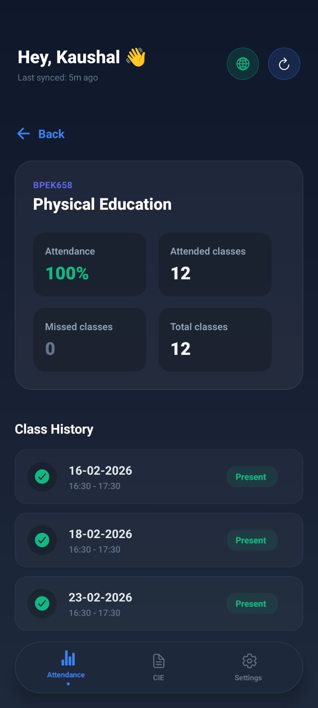
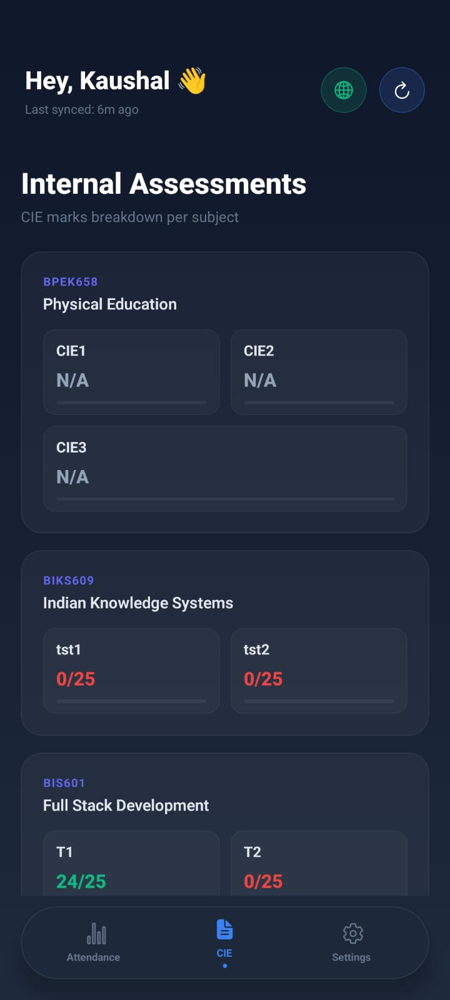

# BunkSafe v2.0.0 🚀


> **Note:** This app is built specifically for **NIE (National Institute of Engineering)** students. It connects exclusively to the `parents.nie.ac.in` student portal.

Bunk Safe is a fully private, locally-run React Native mobile application for students to track their Continuous Internal Evaluation (CIE) marks and attendance without compromising their credentials or data.

## Features ✨

- **100% Private:** Your student credentials (USN & DOB) and academic records never leave your device. All data is stored locally using `AsyncStorage`.
- **Parallel Deep Fetch:** The native `eval()` engine uses pure HTTP string scraping to fetch all CIE and Attendance data seamlessly in parallel within 3 seconds.
- **Detailed Analytics:** Visualizes subject attendance with native grids and taps down to exact daily calendar history (Absent / Present).
- **CIE Dashboard:** Dynamically extracts and presents T1, T2, Q1, Q2 and Total CIE marks with adaptive color-coded grids.
- **Background Watchers:** Smart headless notifications dispatch local alerts to your lockscreen if data hasn't synced in 24 hours.
- **Offline First:** Once synced, you can view your dashboard fully offline without network access.

## Screenshots 📱

| Onboarding | Attendance | CIE Marks |
|:---:|:---:|:---:|
|  |  |  |

## Tech Stack 🛠️

| Layer | Technology |
|---|---|
| Framework | React Native + Expo |
| Language | TypeScript |
| Scraping | `react-native-webview` (Injected JS) |
| Animations | `react-native-reanimated` |
| Storage | `@react-native-async-storage/async-storage` |
| UI | `expo-linear-gradient`, `@expo/vector-icons` |

## How It Works ⚙️

1. **Onboarding:** First-time users are introduced to the app features through a sliding carousel, then enter their USN and DOB.
2. **Local Storage Setup:** Credentials are saved strictly on device storage and never transmitted externally.
3. **Automated Scraping:** When the user taps the refresh icon (or pulls down to refresh):
   - A hidden `WebView` instance navigates to the portal.
   - Using injected JavaScript, it bypasses the heavy web UI and iterates `window.fetch()` against the internal portal APIs instantly.
   - It intercepts nested arrays natively to extract raw JSON variables before DOM hydration finishes.
4. **Dashboard Render:** The native UI instantly reflects the updated, locally saved JSON data efficiently.

## Attendance Logic 📊

- Attendance below **75%** is flagged as ⚠️ **At Risk**.
- Each card shows how many classes you can still bunk safely (or how many you need to attend to recover).
- The top **summary card** shows your overall average and a count of at-risk subjects at a glance.

## Installation 🚀

1. **Clone the repository:**
   ```bash
   git clone https://github.com/kaushal-Prakash/bunk-safe
   cd bunk-safe
   ```

2. **Install dependencies:**
   ```bash
   npm install
   ```

3. **Start the Expo server:**
   ```bash
   npx expo start
   ```

4. **Run on device/emulator:**
   - Scan the QR code with the Expo Go app on your phone.
   - Or press `a` to run on Android / `i` to run on iOS simulators.

> [!WARNING]
> **Installing the APK directly?** Android will warn you that *"This app may be harmful"* or ask you to confirm installing from unknown sources. This is **normal and expected** — the APK is unsigned and not distributed through the Play Store since this is an open-source project without a publisher account. The app is fully safe; you can review all the source code in this repository. Tap **"Install anyway"** to proceed.

## Security & Privacy 🔒

This app is built precisely because many wrapper apps exist that send user credentials to centralized backend servers. With Bunk Safe:
- There is **no backend server**.
- The scraping code runs directly on the client via `react-native-webview`.
- It connects exclusively to the official parent/student portal over HTTPS.

## Roadmap 🗓️

- [x] Attendance tracker with progress bars
- [x] CIE marks dashboard with bar charts
- [x] Pull-to-refresh on all tabs
- [x] Intelligent Deep URL Scraping 
- [x] 2x2 Detailed Subject History Breakdown
- [x] Background Fetch Alerts Configured
- [ ] Bunk calculator tool (reverse engineer: "how many can I miss?")
- [ ] Biometric / PIN app lock
- [ ] Android home screen widget

## Contributing 🤝

Pull requests are welcome. For major changes, please open an issue first to discuss what you would like to change.

## License 📜

Distributed under the MIT License.
